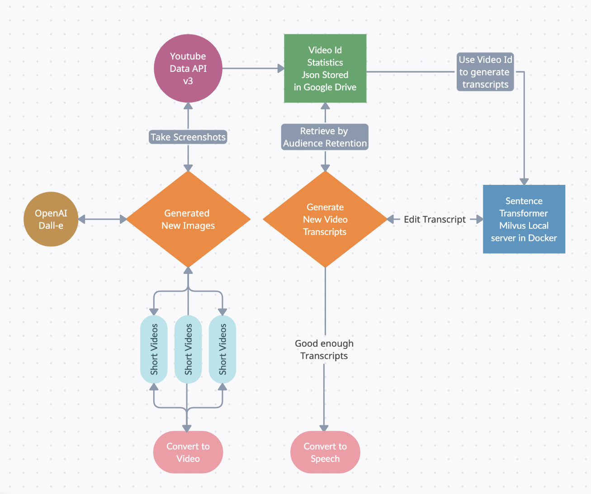

# PatternPivot: Elevating Video Content for Maximum Audience Retention

## Introduction
PatternPivot emerged from the necessity to help content creators fine-tune their videos to bolster audience retention and engagement in an age where capturing attention is crucial yet challenging. Creators often face the hurdle of repurposing their video content effectively, and that's where PatternPivot steps in.

## What PatternPivot Does
PatternPivot is a video generation service that focuses on enabling creators to transform their existing videos into catchy, engaging content in various short-term formats and variations quickly. With LLM-powered transcription at its core, PatternPivot allows for the remixing of video segments, ensuring the new content is primed for audience retention. The innovation lies in its ability to adapt to the competitive content arena, giving creators a much-needed edge.

## How PatternPivot Was Built
The architecture of PatternPivot is the culmination of API integrations, LLM's, a local open-source vector database and free open-source embeddings and semantic search techniques. 

### Our system architecture:

- The YouTube Data API v3 is used to fetch video content.
- Taking screenshots with OpenAI's Dall-e to generate new images.
- Retrieving video statistics for further processing and storing JSON in AWS DynamoDB currently with the intention of utlizing Google Cloud JSON API in the future.
- The vector database used is the open source version of Milvus Local server in Docker. Embedding conversion are designed to be limited to only a select corpus of transcripts as needed by topic stored locally in the server spun up in localhost by the Milvus docker container. 
- Chunking and retrieval augmented generation (RAG) are achieved using LangChain.
- New video transcripts are refined through iterative LLM prompting.
- LLM embeddings are using HuggingFace-hosted "WhereIsAI/UAE-Large-V1" BERT Sentence Transformer  and/or "llmrails/ember-v1". Because of using a BERT base model, the dimensionality is 1024. 
- For document search, stochastic approximate search is used for indexing. 
- Embeddings retrieval use either nearest neighbors or cosine similarity as distance metric.
- OpenAI API's Dall-e is prompted using screencaptures of youtube videos using selenium.
- The only paid API usage for this initiative would be generating images using Dall-e through OpenAI's API and until DynamoDB hits over 25GB or Google Cloud JSON API hitting it's 1 TB limit. 
- Converting transcripts to speech to create new video content will involve Coqui, an open source python module.

The iterative development process was key, focusing on prototypes and refining our algorithms for heightened accuracy. The backend infrastructure is cloud-based, scalable, and designed for efficient processing and a smooth user experience.

## Microservices
### Microservice 1
Youtube request responses to DynamoDB
 - googleapiclient, boto3
### Microservice 2
Search DynamoDB for a unique batch of VideoIds to use as a base to generate new audio
 - Strategy can include LLM's
 - Current strategy randomly shuffles through a given list, existing videos comparing sets of videos with data stored in storage_videoId.py
Extract the audio from the video by converting each VideoId to audio .mp4's
Convert .mp4 audio into .wav audio file formats
Combine batch of .wav audio into a newly generated original audio .wav
 - pytube, pydub, musicGen, nest_asyncio
### Microservice 3
Combine audio .wav with image or video
Save in a queue
 - moviepy
### Microservice 4
QA videos?
Upload videos from a folder to Youtube
 - googleapiclient, google.oauth2 or third party tool
